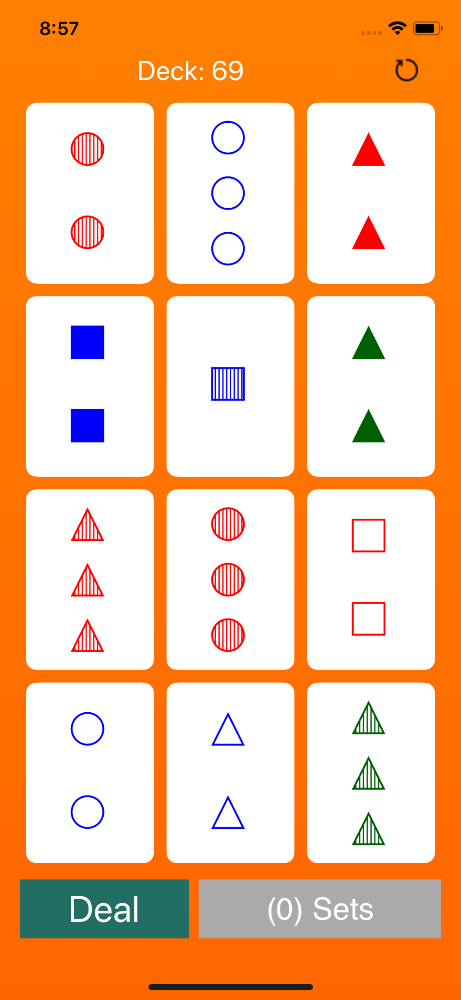
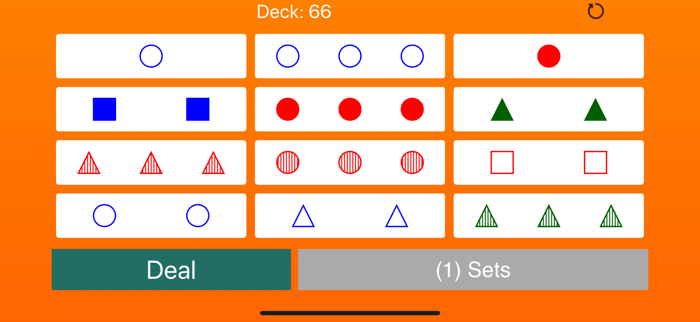

# Sets

Sets is an single player cards matching game based on the popular card game with the same name. Here instead of the diamond,
squiggle and oval the app uses circle , square and triangle to represent the symbols.

The App heavily uses Animation, Core Graphics and UIKitDynamics to mimic the real world behaviour of the cards.

Most of the App has custom UI and layout mechanism to provide a delighful UX.

The layout adjusts itself based on the number of cards visible.

The App is a universal app which supports all screens sizes from iPhone to iPad

### Home Screen

  

### Landscape View

  

